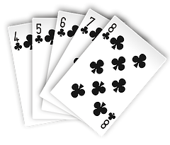
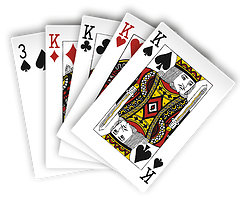
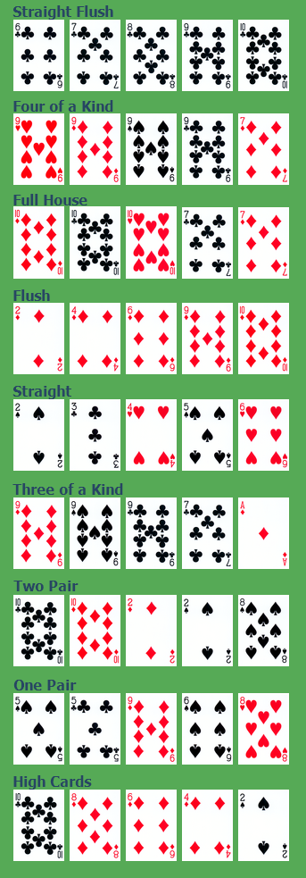

# poker
empirical calculation of probability

compared to [wiki](https://en.wikipedia.org/wiki/Poker_probability) all correct but 
pairs which I get at about 1:2.05 

| Name        | img                                                          | Prob |
| ----------- | ------------------------------------------------------------ | ---- |
| Royal Flush | |      |
| Straight Flush | |      |
| Four of a Kind | |      |

