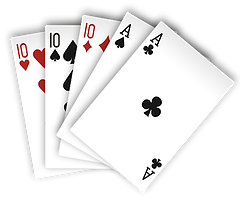
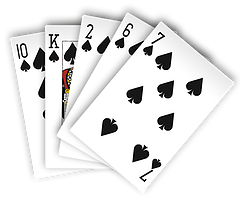
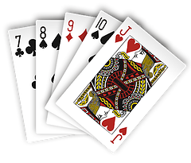
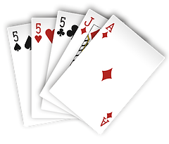
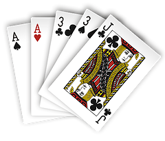

# poker
empirical calculation of probability

compared to [wiki](https://en.wikipedia.org/wiki/Poker_probability) all correct but 
pairs which I get at about 1 : 2.36 or 42.2569% wikipedia has correct % but wrong ratio

| Name        | img                                                          | Prob |
| ----------- | ------------------------------------------------------------ | ---- |
| Royal Flush |       |0.00000154|
| Straight Flush | |0.00001390|
| Four of a Kind |   |0.00024000|
| Full House |         |0.00144100|
| Flush      |             |0.00196500|
| Straight   |          |0.00392500|
| Three of a Kind  ||0.02112800|
| Two Pairs |           |0.04753900|
| One Pair |             |0.42256900| 
| High Card|        |0.50117700|

