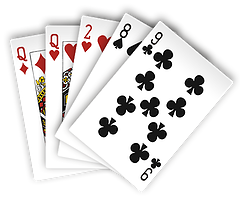

# poker
empirical calculation of probability

compared to [wiki](https://en.wikipedia.org/wiki/Poker_probability) all correct but 
pairs which I get at about 1 : 2.36 or 42.2569% wikipedia has correct % but wrong ratio

| Name        | img                                                          | Prob |
| ----------- | ------------------------------------------------------------ | ---- |
| Sequential Royal|   |0.000000013|
| Royal Flush |       |0.000001540|
| Straight Flush | |0.000013900|
| Four of a Kind |   |0.000240000|
| Full House |         |0.001441000|
| Flush      |             |0.001965000|
| Straight   |          |0.003925000|
| Three of a Kind  ||0.021128000|
| Two Pairs |           |0.047539000|
| One Pair |             |0.422569000| 
| High Card|        |0.501177000|

